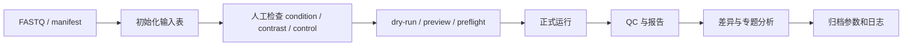

# 通用运行流程

| 状态 | 维护人 | 最后审查 | 适用版本 |
|---|---|---|---|
| Active | Lab pipeline maintainers | 2026-07-15 | `main` |

不要跳过输入表检查。文件名自动推断只能作为初稿，condition、replicate、case/control 和 IgG/Input 必须结合实验设计人工确认。

失败后优先保留原结果目录并使用 `--resume`；不要先删除 Nextflow work/cache。只有确认缓存不可复用或磁盘需要回收时才清理。
