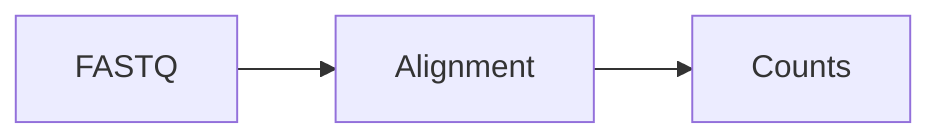

# 自己添加和修改文档

| 状态 | 维护人 | 最后审查 | 适用版本 |
|---|---|---|---|
| Active | Documentation maintainers | 2026-07-16 | `main` |

本站的正文都是 Markdown，位于 `docs/content/`；左侧目录由 `docs/mkdocs.yml` 的 `nav` 控制。修改 Markdown 不需要手写 HTML。

## 1. 第一次准备本地环境

在仓库根目录运行：

```bash
python3 -m venv .venv
source .venv/bin/activate
pip install -r docs/requirements.txt
mkdocs serve -f docs/mkdocs.yml
```

浏览器打开终端显示的本地地址。保存 Markdown 后页面会自动刷新。结束预览用 ++ctrl+c++。

## 2. 修改已有页面

例如修改 RNA-seq Quick Start：

```bash
git switch main
git pull --ff-only
git switch -c docs/update-rnaseq-quick-start

# 编辑此文件
docs/content/pipelines/rnaseq/quick-start.md
```

只修改正文时通常不需要改 `mkdocs.yml`。完成后运行检查并查看差异：

```bash
git diff -- docs/content/pipelines/rnaseq/quick-start.md
bash scripts/validate_public_repo.sh
bash scripts/check_cli_docs.sh
python3 scripts/check_internal_links.py
mkdocs build --strict -f docs/mkdocs.yml
```

## 3. 新增页面并加入目录

假设要增加 `TE annotation` 页面：

```bash
cp docs/content/page-templates/sop.md \
  docs/content/topics/te-annotation.md
```

编辑页面标题、状态、维护人和正文，然后在 `docs/mkdocs.yml` 找到对应栏目：

```yaml
  - 专题:
      - topics/index.md
      - TE 分析: topics/te-analysis.md
      - TE annotation: topics/te-annotation.md
```

!!! warning "YAML 缩进"
    `nav` 使用空格缩进，不能使用 Tab。同一级页面保持相同缩进；`标题: 文件.md` 中冒号后必须有空格。

## 4. 建立多级目录

文件系统和导航层级可以不同，但建议保持一致：

```text
docs/content/tools/rnaseq/
├── index.md
├── bam-to-counts.md
└── counts-to-de.md
```

```yaml
  - 工具与脚本:
      - RNA-seq:
          - tools/rnaseq/index.md
          - BAM 到 counts: tools/rnaseq/bam-to-counts.md
          - Counts 到差异分析: tools/rnaseq/counts-to-de.md
```

## 5. 移动、重命名或删除页面

使用 `git mv` 保留历史：

```bash
git mv docs/content/topics/old-name.md \
       docs/content/topics/new-name.md
```

随后完成三件事：

1. 修改 `mkdocs.yml` 中的旧路径。
2. 搜索并更新站内链接：`grep -R -n 'old-name.md' docs/content docs/mkdocs.yml`。
3. 运行内部链接检查和严格构建。

删除页面前先确认没有其他页面链接它。网页 URL 改变后，外部收藏链接会失效，因此已公开页面尽量少改文件名。

## 6. Markdown 常用写法

### 链接和图片

```markdown
[RNA-seq 输入准备](../pipelines/rnaseq/input.md)

```

图片统一放在 `docs/content/assets/images/`，文件名使用小写英文和短横线，不提交包含真实样本名或内部路径的截图。

### 提示框

```markdown
!!! note "提示"
    这里写补充说明。

!!! warning "重要"
    这里写可能影响结果的操作。
```

### 代码块和表格

````markdown
```bash
bash pipeline.sh --help
```

| 参数 | 默认值 | 说明 |
|---|---|---|
| `--species` | `hg38` | 参考基因组 |
````

### Mermaid 流程图

````markdown

````

## 7. 页面状态和内容来源

- `Draft`：可以在线查看，但尚未完成或未经实验室确认。
- `Active`：命令、输出和科学解释已经审核。
- `Deprecated`：保留用于旧项目，但不建议新分析使用。
- `Archived`：仅作历史记录。

页面中的技术事实按以下优先级核对：当前代码和 `--help` → 当前配置/实际输出 → 旧文档。遇到冲突时不要静默选择，先在页面标注并建立 issue。

## 8. 提交和发布

```bash
git add docs/content docs/mkdocs.yml
git commit -m "docs: add TE annotation guide"
git push -u origin docs/update-rnaseq-quick-start
```

创建 Pull Request，确认 Actions 全部通过后合并。合并到 `main` 会自动更新 GitHub Pages。

## 9. 常见问题

| 现象 | 处理 |
|---|---|
| 页面存在但左侧没有 | 将它加入 `nav`；严格构建会提示 omitted file |
| 构建报 YAML 错误 | 检查冒号、引号、Tab 和缩进 |
| 点击链接 404 | 使用相对 Markdown 路径并运行链接检查 |
| 图片本地可见、线上丢失 | 检查大小写；GitHub/Linux 区分大小写 |
| Actions 失败但本地成功 | 打开失败步骤日志，比较 Python、命令依赖和文件名大小写 |
| 不确定是否能公开 | 暂不提交，先替换样本名、路径和截图中的内部信息 |
