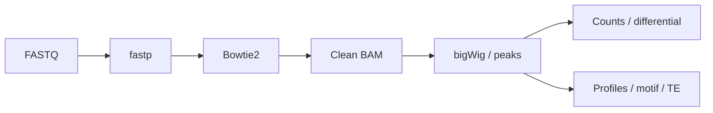

# ATAC-seq

| 状态 | 维护人 | 最后审查 | 适用版本 |
|---|---|---|---|
| Active | ATAC-seq maintainers | 2026-07-15 | `main` |

bulk ATAC-seq 流程覆盖 FASTQ QC、alignment、clean BAM、bigWig、peak calling、consensus peaks、peak/bin differential accessibility、TE annotation、motif、footprinting 与 nucleosome phasing。

适用于 bulk ATAC-seq；PE 与 SE 的计数单位不同，不能放入同一 count matrix。推荐入口为 `ATAC-seq/run_auto_atacseq.sh`。

