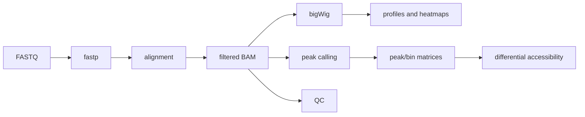

# ATAC-seq pipeline

| 状态    | 维护人 | 最后审查       | 适用版本   |
| ----- | --- | ---------- | ------ |
| Draft | MCC | 2026-07-16 | `main` |

本流程把 FASTQ 转换为可复核的比对、开放染色质 peaks、信号轨迹、QC 和差异可及性结果。入口是 `ATAC-seq/run_auto_atacseq.sh`。

## 适用范围

- bulk ATAC-seq，支持 paired-end（PE）和 single-end（SE）；
- `hg38`、`mm10`、`mm39`；
- 多样本 QC、peak/bin 定量、差异分析和常规可视化；
- 以 TE 区域为目标的 relaxed track 和 metaprofile 探索。

不用于单细胞 ATAC-seq，也不把 relaxed TE track 当作严格的多重比对定量结果。PE 与 SE 的计数单位不同，不应放入同一差异矩阵。

## 从哪里开始

1. 首次使用先读 [Quick Start](quick-start.md)。
2. 正式项目先确认 [输入格式](input.md) 与 [QC](qc.md)。
3. 完成后根据 [输出指南](outputs.md) 找到最重要文件。

!!! warning "方法学边界"

    当前 TSS profile 基于 bigWig 信号，并不等同于 ENCODE 定义的、基于 Tn5 insertion 的 TSS enrichment score。报告时必须使用准确名称。
