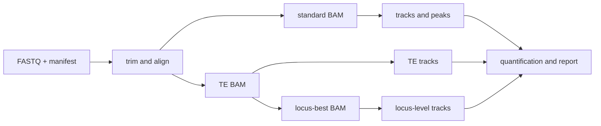

# CUT&RUN / CUT&Tag / ChIP-seq pipeline

| 状态 | 维护人 | 最后审查 | 适用版本 |
|---|---|---|---|
| Draft / under development | CUT&RUN maintainers | 2026-07-16 | `main` |

该流程使用 `CUTnRUN/pipelines/chipseq_auto_nf/run_auto_chipseq.sh` 统一处理 CUT&RUN、CUT&Tag 和 ChIP-seq，从 FASTQ 生成 standard、TE-aware 和 locus-best 信号、peaks、定量、QC 与报告。

!!! warning "尚未稳定"

    CUT&RUN pipeline 仍在开发与验证中。本章记录当前代码行为，不代表接口、默认值和输出结构已经冻结；正式项目使用前必须以当前 `--help`、实际 dry-run 和小数据验证为准。

## 适用范围

- `cutrun`、`cuttag`、`chipseq` assay；
- `hg38` 与 `mm39`；
- narrow 与 broad marks；
- 有 matched control 的 peak calling 与定量；
- TE family、subfamily 或 locus 层面的探索性分析。

不应把没有 control、重复不足或外部方法失败的结果包装成完整证据。RepEnTools 等方法存在 genome/annotation 限制，unsupported 组合必须明确跳过。

首次使用从 [Quick Start](quick-start.md) 开始；解释结果前阅读 [三类 BAM 与输出](outputs.md) 和 [QC](qc.md)。
