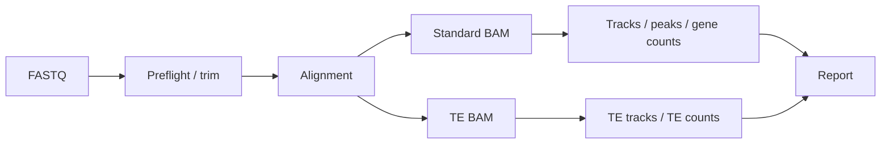

# CUT&RUN / CUT&Tag / ChIP-seq

| 状态 | 维护人 | 最后审查 | 适用版本 |
|---|---|---|---|
| Active | CUT&RUN maintainers | 2026-07-15 | `main` |

同一 Nextflow pipeline 支持 CUT&RUN、CUT&Tag 和 ChIP-seq，生成标准唯一/高质量分支与 TE 多重比对分支，包括 BAM、bigWig、narrow/broad peaks、gene/TE counts、annotation、correlation 和报告。

支持 `hg38` 与 `mm39`。推荐入口：`CUTnRUN/pipelines/chipseq_auto_nf/run_auto_chipseq.sh`。

