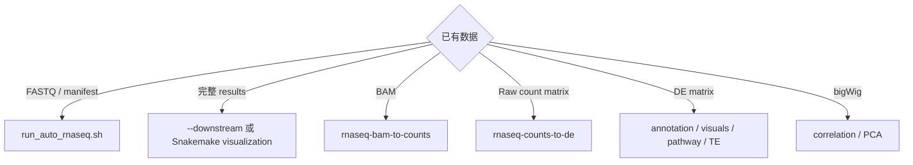

# RNA-seq 下游与 TE 分析
从什么文件开始决定使用哪个入口。不要为了补一张图重跑全部 FASTQ，也不要把缺少上游 QC 的独立工具结果描述为完整 pipeline 结果。
## 选择入口



## 已有主流程 results

先核对 `condition.csv` 和 `contrast.csv`，然后：

```bash
bash RNA-seq/rnaseq/run_auto_rnaseq.sh \
  --results-dir /path/to/results \
  --species hg38 \
  --downstream
```

多个 matrix/contrast 的批量补图使用 `snakemake-visualization/`，先生成配置并 dry-run，确认纳入哪些矩阵。

## 已有 BAM

使用 `rnaseq-bam-to-counts` 前确认 BAM build、sort/index、layout、strand 和 GTF。Gene 与 TE counting 需要不同 annotation 和 multi-mapping 前提；只保留唯一比对的 BAM 可能不适合 locus-level TE 工具。

## 已有 count matrix

`rnaseq-counts-to-de` 需要 raw integer-like counts、sample table 和 contrast。TPM/FPKM/CPM 不能直接当作依赖 raw counts 分布的差异模型输入。

输出应包括 normalized matrix、sample QC、完整差异表、筛选结果、volcano/MA/heatmap 和 pathway 状态。

## 已有 DE matrix

可补 annotation、volcano/MA、pathway 和 TE hierarchy 图，但必须确认列名、case/control 方向、ID 类型、物种和背景基因集合。缺少 raw counts 时不能重新评估 sample-level QC 或 normalization。

## 已有 bigWig

bigWig correlation/PCA 受 normalization、bin size、blacklist 和 coverage 影响。只有这些设置一致时才比较多个轨道。

## TE 方法选择

| 问题 | 推荐层级 | 典型方法 |
|---|---|---|
| 哪些 TE subfamily 改变 | family/subfamily | TEtranscripts、REdiscoverTE rollup |
| 哪些具体 locus 改变 | locus | Telescope、TElocal |
| 多个 annotation 层级是否一致 | hierarchy | REdiscoverTE/统一 rollup |
| 结果是否依赖 multi-mapper 方法 | sensitivity | 比较多个可兼容工具 |

报告 TE 结果时写清 genome build、RepeatMasker/TE annotation 版本、计量层级、strandedness、multi-mapper 分配和差异方法。更多原则见[TE 分析专题](../../topics/te-analysis.md)。
