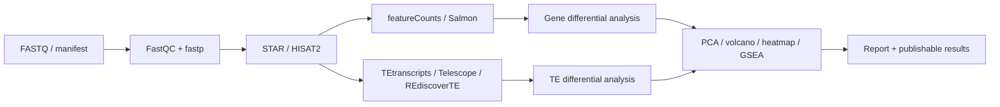

# RNA-seq Pipeline
本流程面向常规 bulk RNA-seq，从本地 FASTQ 或 accession manifest 开始，完成 reads 质控、gene alignment/quantification、多个 TE quantification 分支、MultiQC、差异表达、GSEA 和标准图形。推荐入口是：

```text
/home/machicheng/RNA-seq/Pipeline/rnaseq/rnaseq/run_auto_rnaseq.sh
```
## 适用范围
- Illumina bulk RNA-seq，支持 PE/SE 自动识别。
- 人类 `hg38`；小鼠 `mm10`、`mm39`。
- 有/无 biological replicates 的 gene/TE differential expression。
- 从已有 BAM、count matrix、DE matrix 或 bigWig 补做分析。

不适用于 single-cell、spatial、small RNA、long-read 或 allele-specific RNA-seq。没有 biological replicate 时只能做明确标注的探索性 effect-size 分析。
## 数据流



## 默认方法边界
- 普通 counts 不默认使用 duplicate-removed BAM；duplicate metrics 用于 QC。
- TE 工具对 multi-mapping reads、annotation 层级和输出单位的处理不同，不能直接互换。
- REdiscoverTE 默认只在人类 `hg38` 运行；其他物种或 reference 需要先确认资源支持。
- `condition.csv` 和 `contrast.csv` 必须人工核对，自动生成的内容只是模板。
## 从哪里开始

- 第一次运行：[Quick Start](quick-start.md)
- 准备实验设计：[输入准备](input.md)
- 查全部参数：[参数](parameters.md)
- 找结果文件：[输出](outputs.md)
- 判断样本质量：[QC](qc.md)
- 已有 BAM/counts/DE/bigWig：[下游与 TE](downstream.md)
