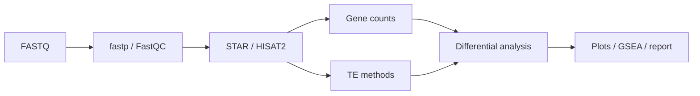

# RNA-seq

| 状态 | 维护人 | 最后审查 | 适用版本 |
|---|---|---|---|
| Active | RNA-seq maintainers | 2026-07-15 | `main` |

bulk RNA-seq 主流程覆盖 FASTQ QC、STAR/HISAT2 比对、gene quantification、TE quantification、差异表达、GSEA 与标准图形。

适用于 Illumina bulk RNA-seq；不适用于 single-cell、spatial、small RNA 或长读长分析。推荐入口为 `RNA-seq/rnaseq/run_auto_rnaseq.sh`。

