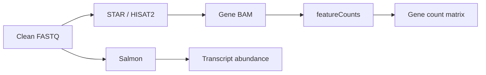

# RNA-seq Workflow

| 状态 | 维护人 | 最后审查 | 适用版本 |
|---|---|---|---|
| Draft | RNA-seq maintainers | 2026-07-16 | `main.nf` / `nextflow.config` |

## 1. 输入解析与预检

自动入口扫描 FASTQ 或解析 manifest，确定 sample、R1/R2 和 layout，并保存 resolved input。dry-run 在提交任务前检查主要参数和计划模块。实验设计文件与 FASTQ 技术输入分开：上游可先完成，随后人工确认 condition/contrast 再运行统计下游。

## 2. Reads QC 和预处理

- FastQC 检查原始 reads 质量、adapter、GC 和 duplication pattern。
- fastp 负责 trimming/clean FASTQ，并产生独立 HTML/JSON 报告。
- MultiQC 在流程后期聚合可识别的 QC 和软件日志。

fastp 的 duplication 指标与 Picard/BAM duplicate metrics 含义不同，不应直接互换。

## 3. Gene 分支

featureCounts 依赖 GTF、feature type、gene attribute 和 strandedness。Salmon 输出是 transcript-level abundance，转换成 gene-level 时必须记录 tx2gene/annotation 版本。

## 4. Duplicate 与 RNA metrics

默认 `--run-markdup-qc true` 生成 duplicate metrics，但不改变主 counts。`--run-dedup false` 避免普通 RNA-seq 因 PCR/高表达基因而误删大量有效 reads。只有实验设计或既定 SOP 明确要求时才用 dedup BAM 计数。

Picard RNA metrics 可提供 coding/UTR/intronic/intergenic 和 strand/bias 信息；需要匹配 build 的 refFlat 和可选 rRNA intervals。

## 5. TE 分支

| 方法 | 主要层级 | 说明 |
|---|---|---|
| TEtranscripts/TEcount | family/subfamily | gene 与 TE 联合/聚合定量 |
| Telescope | locus | 使用 EM 分配 multi-mapped reads |
| REdiscoverTE | 分层 annotation | 当前主要用于 hg38，并生成 rollup |
| TElocal | locus | 默认关闭，按需启用 |
| SalmonTE | subfamily | 实验性兼容模块，默认关闭 |

不同工具的 count 定义、annotation 和 multi-mapper 策略不同。比较结果时先确认层级与单位，不应直接拼接不同方法的矩阵。

## 6. 下游统计

下游读取 count matrix、`condition.csv` 和 `contrast.csv`，检查样本完整性后生成 normalization、PCA/correlation、差异表、volcano/MA/heatmap、annotation、pathway/GSEA 和 TE 分层图。

## 7. 复现信息

一次可复现运行至少应保留：Git commit、入口命令、resolved input、condition/contrast、reference/annotation 版本、Nextflow report/trace、软件环境、核心 counts 和 QC。最终图必须能追溯到对应 count matrix 与 contrast。
